# SOC Lab 1 – Windows Sysmon Log Ingestion with Splunk

## Overview

This lab demonstrates end-to-end Windows log ingestion into Splunk using Sysmon and the Splunk Universal Forwarder.

The objective was to configure, troubleshoot, and validate a working SOC-style log pipeline suitable for monitoring and detection engineering.

---

## Lab Environment

- Windows 11 VM
- Sysmon (Microsoft System Monitor)
- Splunk Universal Forwarder
- Ubuntu VM running Dockerized Splunk Enterprise
- TCP Port 9997 for log forwarding

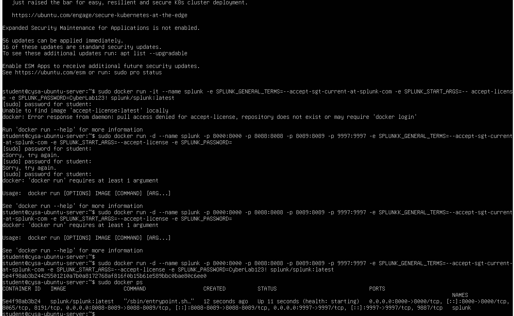
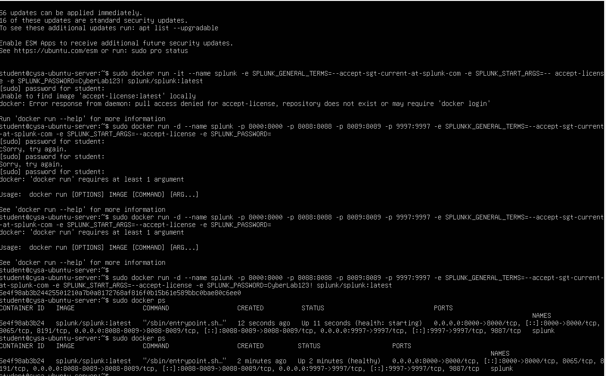
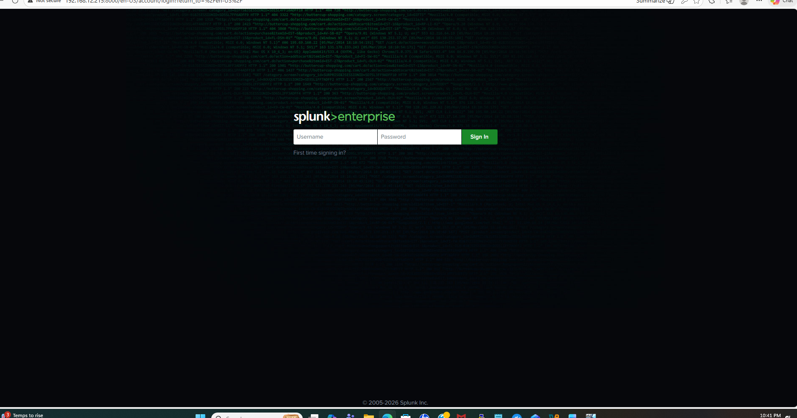
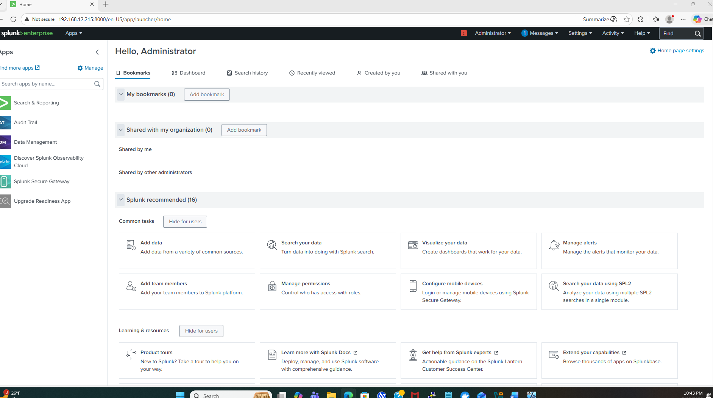

---

## Architecture

Windows 11  
→ Sysmon generates logs  
→ Splunk Universal Forwarder  
→ TCP 9997  
→ Splunk Enterprise (Ubuntu Docker)  
→ Indexed into:
- wineventlog
- sysmon

This architecture simulates a simplified SOC telemetry pipeline where endpoint telemetry is centrally aggregated and analyzed within a SIEM platform.
---

## Index Creation

Two custom indexes were created in Splunk:

- `wineventlog`
- `sysmon`

Verified in:

Settings → Indexes

### Custom Windows Index Created

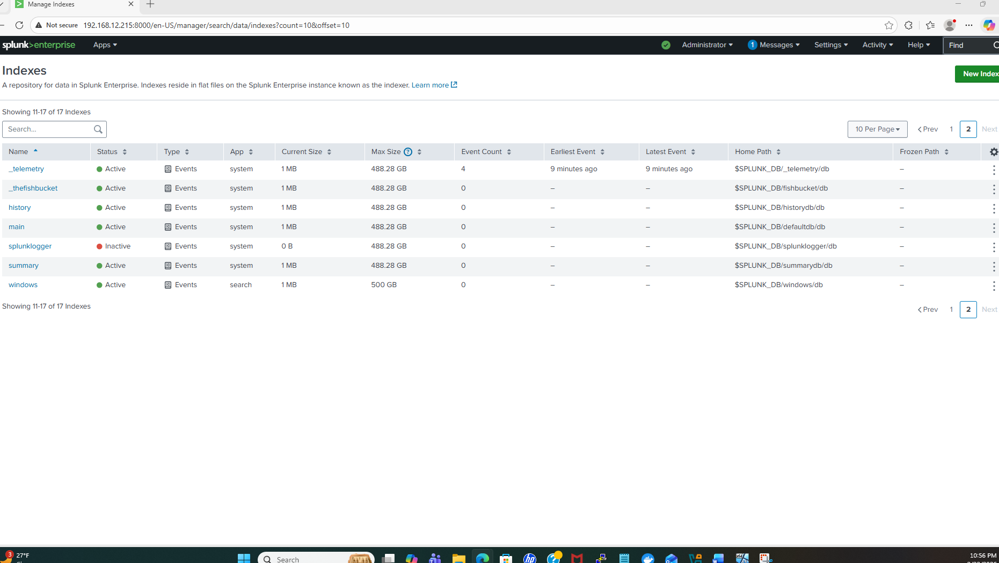

## Receiving Port Configuration

Splunk was configured to receive logs on TCP port 9997.

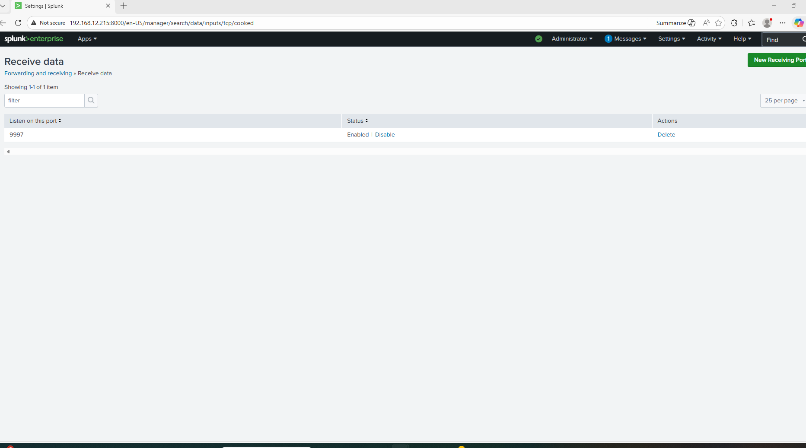
---

## Universal Forwarder Configuration

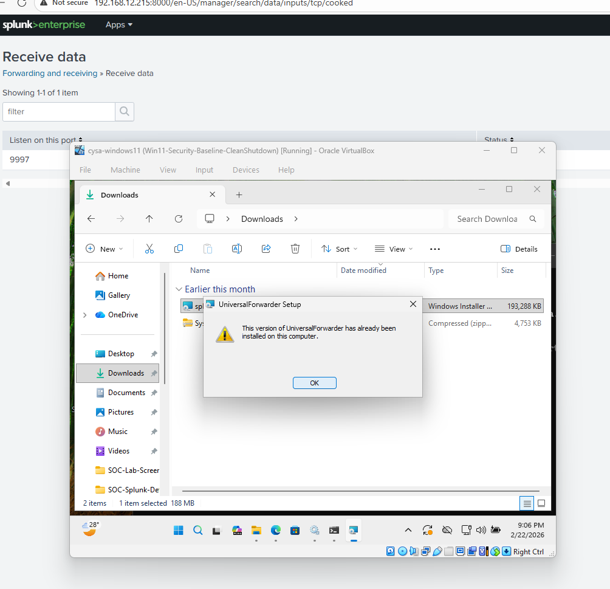

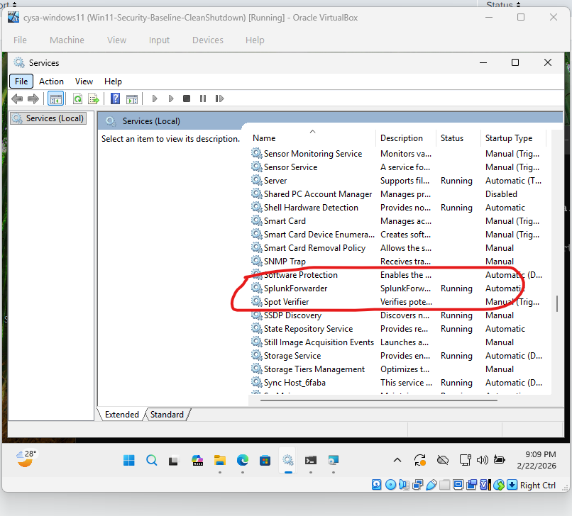

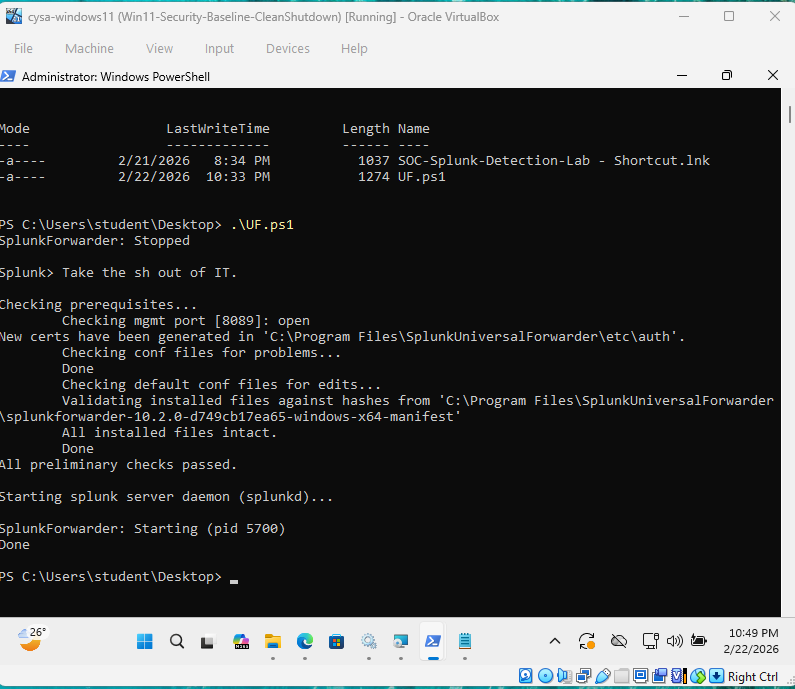
---

### inputs.conf
```ini
[WinEventLog://Application]
index = wineventlog

[WinEventLog://Security]
index = wineventlog

[WinEventLog://System]
index = wineventlog

[WinEventLog://Microsoft-Windows-Sysmon/Operational]
disabled = 0
renderXml = true
index = sysmon
```
### outputs.conf
```ini
[tcpout]
defaultGroup = indexer_group

[tcpout:indexer_group]
server = <Splunk_Server_IP>:9997
useACK = true
```
The SplunkForwarder service was configured to run as:

LocalSystem

This was required to allow access to the Sysmon event channel.

## Verification – Windows Event Logs

SPL Used:
```
index=wineventlog | stats count by sourcetype
```
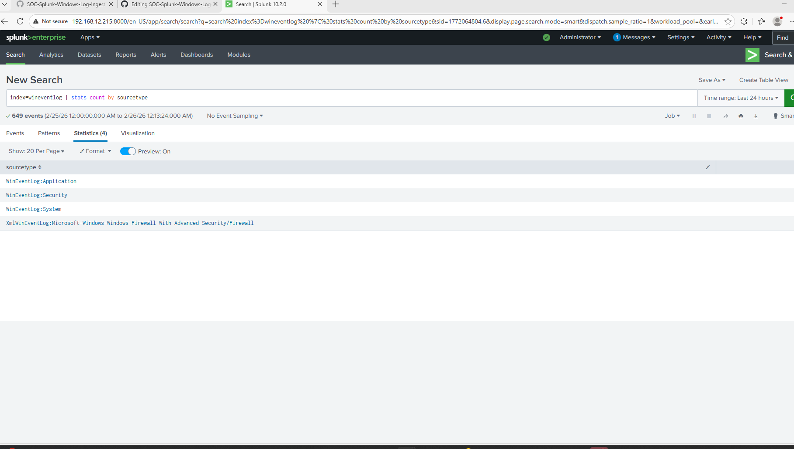

Confirmed ingestion of:
- Application logs
- Security logs
- System logs
- Firewall logs

---

## Verification – Sysmon Ingestion

SPL Used:

```
index=sysmon
```


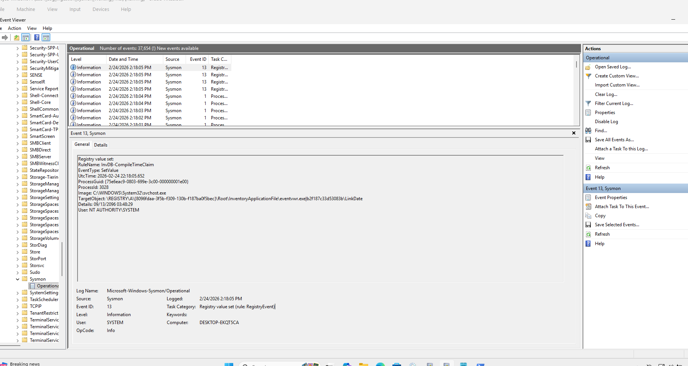

Confirmed:
- Event ID 1 (Process Creation)
- CommandLine field visibility
- ParentImage
- Hash values
- Sourcetype: XmlWinEventLog:Microsoft-Windows-Sysmon/Operational
  
---  

## Issues Encountered & Resolution

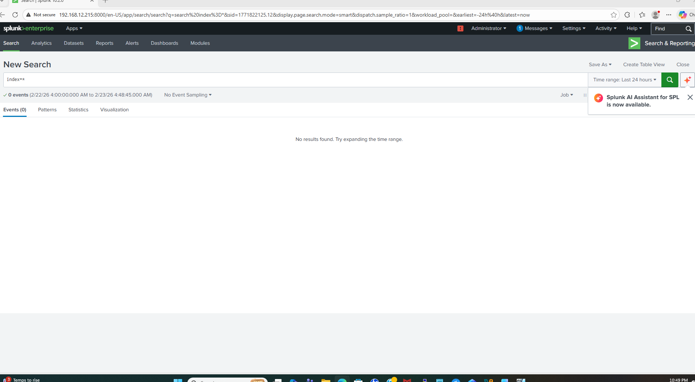

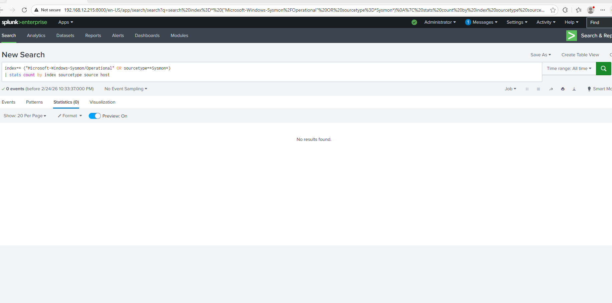

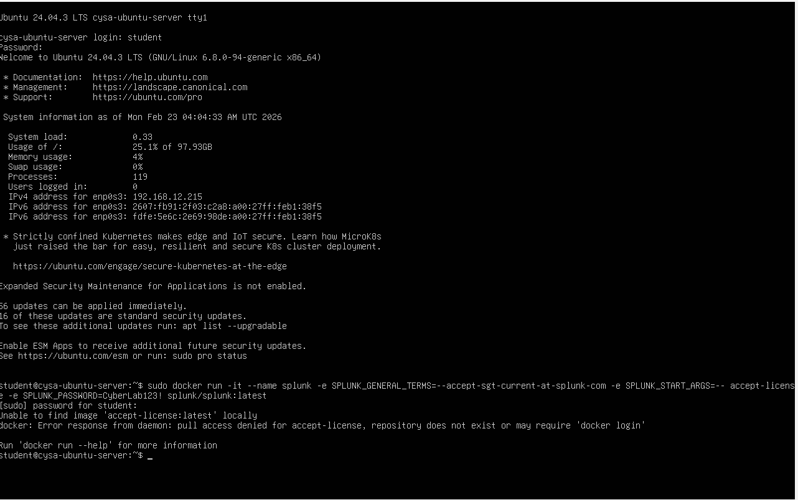

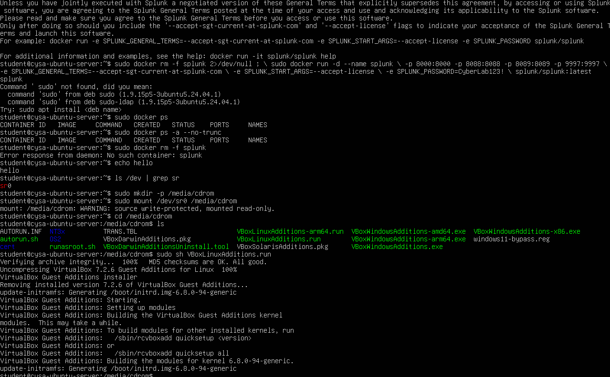

---

### Issue: Sysmon logs not ingesting
Symptoms:
- wineventlog index populated
- sysmon index empty

Root Cause:
The SplunkForwarder service was running under the default service account:
NT SERVICE\SplunkForwarder.

This account does not have sufficient privileges to access the
Microsoft-Windows-Sysmon/Operational event channel.

Resolution:
Changed service account to:
LocalSystem

Restarted forwarder service.

Result:
Sysmon logs successfully ingested into the sysmon index.

## Skills Demonstrated

- Splunk index configuration
- Universal Forwarder deployment
- Windows Event Log monitoring
- Sysmon configuration
- Service account troubleshooting
- btool validation
- SPL verification
- End-to-end ingestion validation
- SOC-style log pipeline debugging

---

## Snapshot Strategy

A final stable VM snapshot was created to preserve the validated ingestion state:

Lab1_Log_Ingestion_Sysmon_Working_Final

This allows rollback to a verified working ingestion state.

---

## Outcome

Successfully built, configured, and validated a Windows log ingestion pipeline suitable for SOC monitoring and detection workflows.

---
